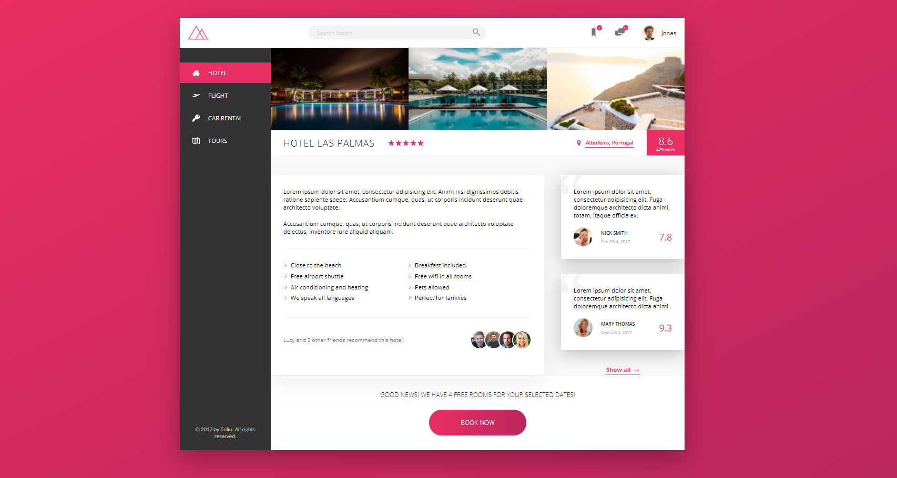
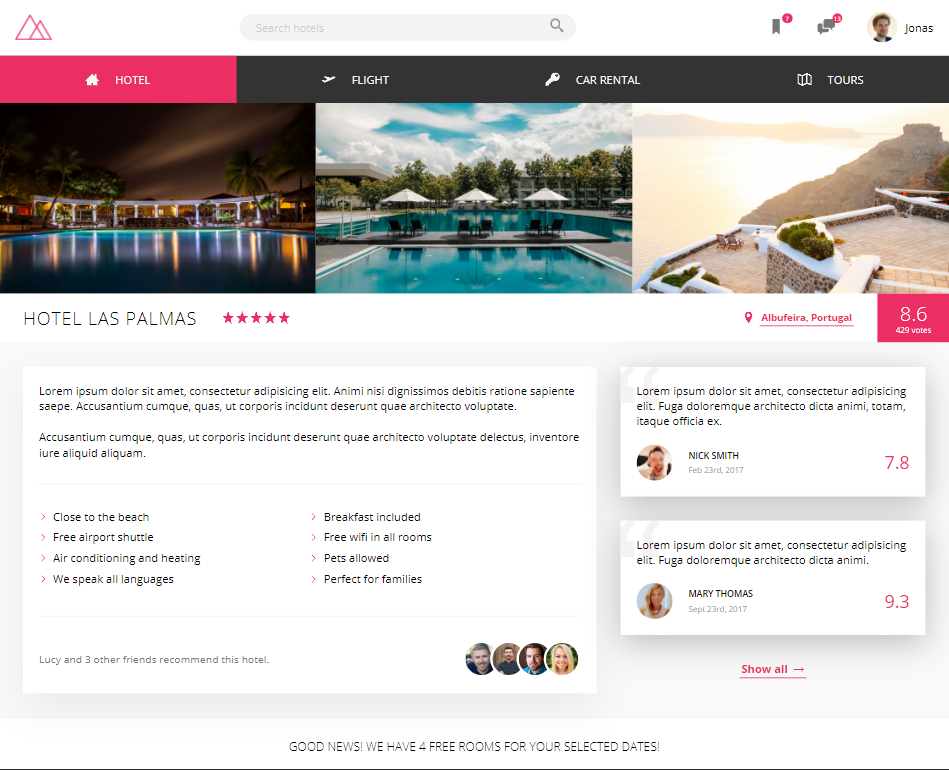
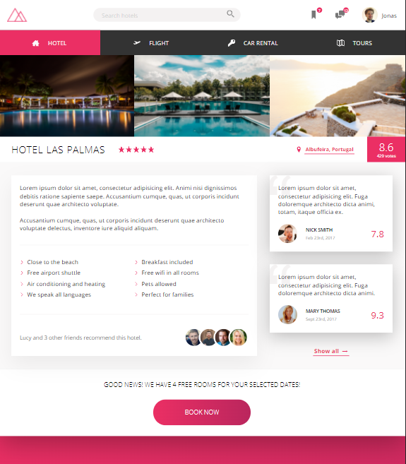
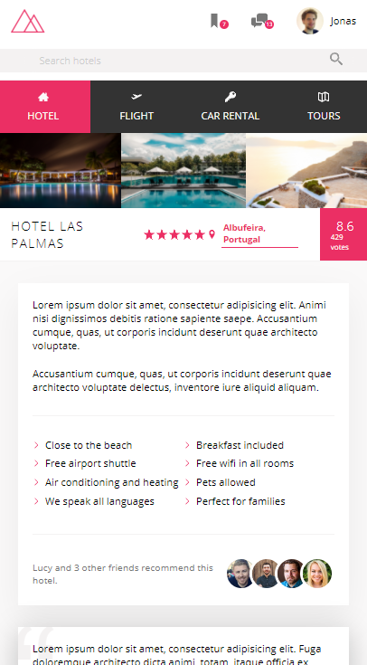

## Flex template Trillo
## Table of contents
* [General info](#general-info)
* [Technologies](#technologies)
* [Setup](#setup)
* [Layout](#layout)

## General info
The main goal of the project is to build a website based on the flex approach
	
## Technologies
Project is created with:
* CSS/SCSS
* HTML
	
## Setup
To run this project, open index.html on your browser

## Responsive Layout
* Main device

* Tablet

* iPad

* iPhone

